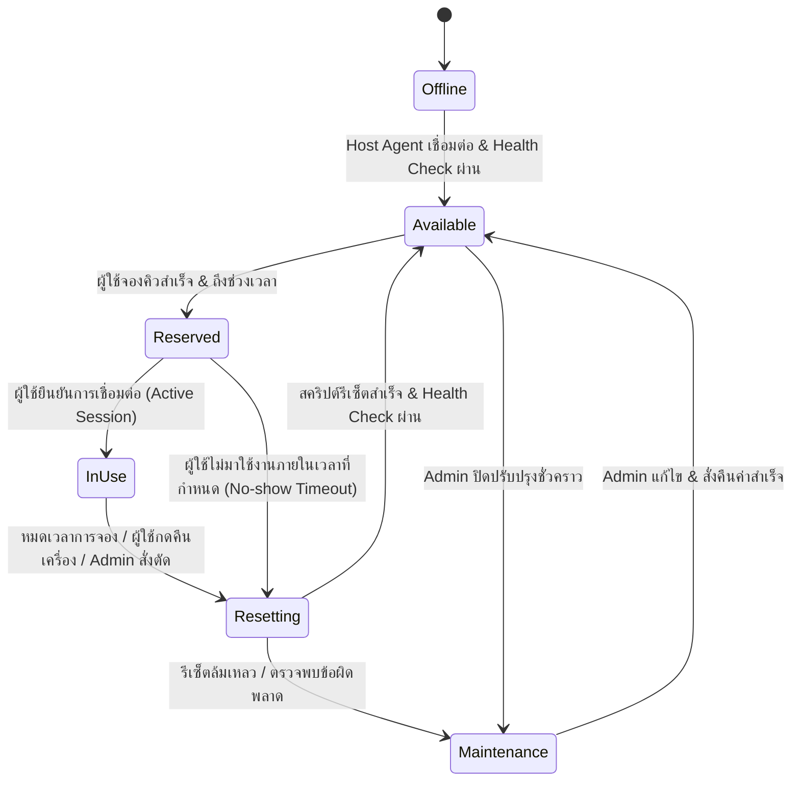
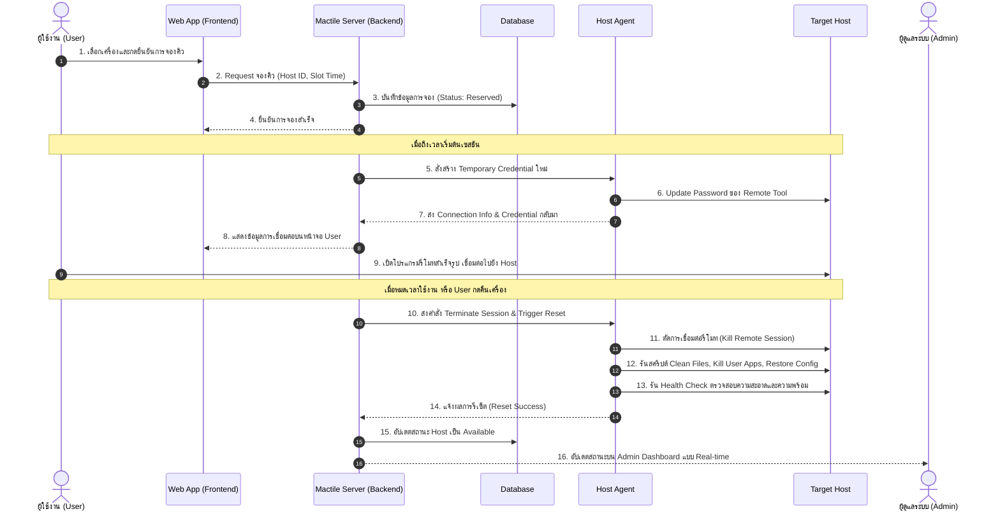
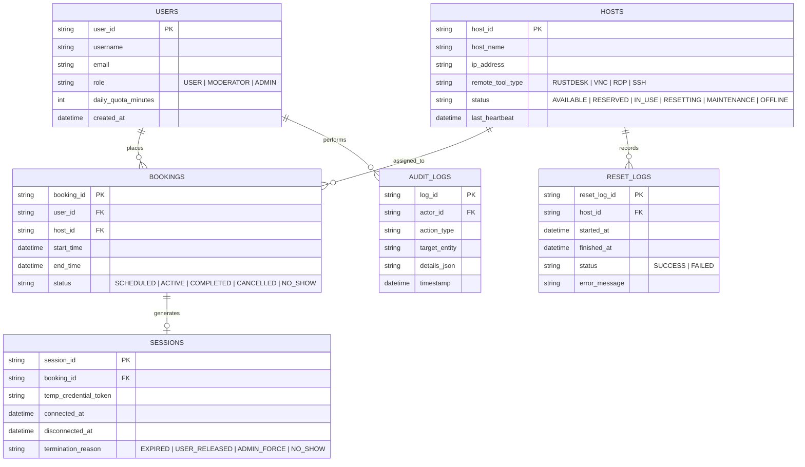

# เอกสารข้อกำหนดความต้องการของระบบ (Software Requirements Specification - SRS)
## โครงการ: Mactile (MVP) — แพลตฟอร์มบริหารจัดการจองคิวและการเข้าถึงเครื่องรีโมท
**กลุ่มที่:** 4  
**เวอร์ชันเอกสาร:** 1.0  
**วันที่จัดทำ:** 16 สิงหาคม 2026  
**เอกสารอ้างอิง:** [docs/project_charter.md](file:///D:/LAB-DOC/docs/project_charter.md)

---

## 1. บทนำ (Introduction)

### 1.1 วัตถุประสงค์ของเอกสาร (Purpose)
เอกสารข้อกำหนดความต้องการของระบบ (SRS) ฉบับนี้จัดทำขึ้นเพื่อระบุข้อกำหนดเชิงหน้าที่ (Functional Requirements) และข้อกำหนดที่ไม่ใช่เชิงหน้าที่ (Non-Functional Requirements) สำหรับระบบ **Mactile (MVP)** โดยมีเป้าหมายเพื่อเป็นแนวทางอ้างอิงหลักสำหรับทีมพัฒนา ผู้ทดสอบระบบ และผู้ดูแลระบบในการดำเนินงานพัฒนาในระยะ MVP

### 1.2 ขอบเขตของผลิตภัณฑ์ (Product Scope)
**Mactile** เป็นระบบควบคุมและจัดสรรการเข้าใช้งานเครื่องคอมพิวเตอร์/เครื่องเซิร์ฟเวอร์แบบรีโมท โดยมุ่งเน้น 4 ขอบเขตหลัก:
1. **ระบบจองคิวและการเข้าถึง (Queue Booking & Access Management)**
2. **ระบบจัดการและรีเซ็ตสภาพแวดล้อมเบื้องต้น (Environment Management & Basic Resetting)**
3. **การเชื่อมต่อรีโมทด้วยโปรแกรมสำเร็จรูป (Remote Connection via Existing Tools)**
4. **หน้า Dashboard ผู้ดูแลระบบ (Admin Dashboard)**

### 1.3 คำจำกัดความและคำย่อ (Definitions & Abbreviations)
- **Host / Target Host:** เครื่องคอมพิวเตอร์ปลายทางที่เปิดให้ผู้ใช้เข้ามาเชื่อมต่อเพื่อใช้งาน (เช่น macOS Build Host, Linux/Windows Workstation)
- **Host Agent:** โปรแกรมหรือสคริปต์เบื้องหลังที่ติดตั้งบน Target Host ทำหน้าที่สื่อสารกับ Server, รายงานสถานะ และสั่งรันสคริปต์รีเซ็ต
- **Queue Slot:** ช่วงเวลาที่ถูกแบ่งไว้สำหรับการจองใช้งานเครื่อง (เช่น ช่องละ 30 หรือ 60 นาที)
- **One-time / Ephemeral Credential:** ข้อมูลรหัสผ่านหรือโทเคนที่สร้างขึ้นชั่วคราวสำหรับรอบการใช้งานของผู้ใช้คนนั้นๆ และจะถูกทำลาย/รีเซ็ตเมื่อหมดเวลา
- **Baseline Snapshot / Clean State:** สภาพแวดล้อมมาตรฐานที่สะอาด ปราศจากไฟล์ตกค้างหรือบัญชีส่วนตัวของผู้ใช้งานรอบก่อนหน้า
- **Off-the-shelf Remote Tool:** โปรแกรมรีโมทหน้าจอสำเร็จรูปที่มีอยู่แล้ว เช่น RustDesk, VNC, RDP, AnyDesk, SSH

---

## 2. ภาพรวมระบบและสถาปัตยกรรม (System Overview)

### 2.1 วงจรสถานะของเครื่องเป้าหมาย (Host Lifecycle State Machine)

### 2.2 โมเดลบทบาทผู้ใช้งาน (User Roles & Permissions)

| สิทธิ์ / ฟังก์ชัน | ผู้ใช้งานทั่วไป (User) | เจ้าหน้าที่ดูแล (Moderator) | ผู้ดูแลระบบ (Admin) |
| :--- | :---: | :---: | :---: |
| ดูรายการเครื่องและสถานะว่าง/ไม่ว่าง | ✅ | ✅ | ✅ |
| จองคิว / ยกเลิกคิวตนเอง | ✅ | ✅ | ✅ |
| รับ Credential และเชื่อมต่อรีโมทตามคิว | ✅ | ✅ | ✅ |
| กดคืนเครื่อง / ขอต่อเวลา | ✅ | ✅ | ✅ |
| ดูคิวและประวัติการใช้งานทั้งหมด | ❌ | ✅ | ✅ |
| จัดการ/ยกเลิกคิวของผู้ใช้อื่น | ❌ | ✅ | ✅ |
| สั่ง Force Disconnect / Force Reset | ❌ | ✅ | ✅ |
| เพิ่ม/ลบ/แก้ไขเครื่อง และตั้งค่านโยบายระบบ | ❌ | ❌ | ✅ |
| จัดการบัญชีผู้ใช้และกำหนดสิทธิ์ | ❌ | ❌ | ✅ |

---

## 3. ข้อกำหนดเชิงหน้าที่ (Functional Requirements)

### 3.1 โมดูลที่ 1: ระบบจองคิวและการเข้าถึง (Queue Booking & Access Management)

| รหัสข้อกำหนด | ชื่อข้อกำหนด | รายละเอียดการทำงาน (Specification) | ระดับความสำคัญ |
| :--- | :--- | :--- | :---: |
| **FR-1.1** | การแสดงรายการเครื่องและตารางคิว | ระบบต้องแสดงรายการ Host ทั้งหมด พร้อมสถานะปัจจุบัน (Available, Busy, Resetting, Maintenance) และตารางเวลาการจอง (Calendar/Slot View) | High (Must Have) |
| **FR-1.2** | การจองคิวแบบกำหนดช่วงเวลา (Time-slot Booking) | ผู้ใช้สามารถเลือกเครื่องและจองช่วงเวลาการใช้งานได้ตามโควตาที่กำหนด (เช่น สูงสุด 2 ชั่วโมงต่อครั้ง) | High (Must Have) |
| **FR-1.3** | การจำกัดสิทธิ์ตามเวลา (Time-bound Access Control) | ระบบต้องอนุญาตให้สร้างเซสชันการเชื่อมต่อได้เฉพาะช่วงเวลาที่จองไว้เท่านั้น และปฏิเสธการเชื่อมต่อหากอยู่นอกเวลา | High (Must Have) |
| **FR-1.4** | การแจ้งเตือนสถานะคิวและการนับเวลา | ระบบต้องแสดงตัวนับเวลาถอยหลัง (Countdown Timer) และแจ้งเตือนก่อนหมดเวลา (เช่น แจ้งเตือนล่วงหน้า 5 นาที) | High (Must Have) |
| **FR-1.5** | การคืนเครื่องก่อนเวลา (Early Session Release) | ผู้ใช้สามารถกดปุ่ม "คืนเครื่อง (Release Host)" เมื่อทำงานเสร็จก่อนเวลา เพื่อส่งเครื่องเข้าสู่กระบวนการรีเซ็ตทันที | Medium (Should Have) |
| **FR-1.6** | การขอต่อเวลา (Extend Session) | ผู้ใช้สามารถขอต่อเวลาใช้งานได้ (เช่น ครั้งละ 15-30 นาที) หากไม่มีคิวของผู้ใช้อื่นจองต่อในช่วงเวลาถัดไป | Medium (Should Have) |
| **FR-1.7** | การจัดการกรณีไม่มาใช้งาน (No-show Handling) | หากผู้ใช้ไม่เริ่มเชื่อมต่อภายใน 10 นาทีหลังจากถึงเวลาจอง ระบบจะยกเลิกสิทธิ์และปล่อยคิวให้ผู้อื่น หรือเข้าสู่การรีเซ็ต | Low (Nice to Have) |

---

### 3.2 โมดูลที่ 2: ระบบจัดการและรีเซ็ตสภาพแวดล้อมเบื้องต้น (Environment Management & Basic Reset)

| รหัสข้อกำหนด | ชื่อข้อกำหนด | รายละเอียดการทำงาน (Specification) | ระดับความสำคัญ |
| :--- | :--- | :--- | :---: |
| **FR-2.1** | Host Agent Service & Heartbeat | ต้องมีโปรแกรมเบื้องหลัง (Agent/Daemon) ทำงานบน Target Host เพื่อส่งสัญญาณ Heartbeat รายงานสถานะ และรับคำสั่งรีเซ็ตจาก Server | High (Must Have) |
| **FR-2.2** | การทำความสะอาดไฟล์ชั่วคราวและแคช (Workspace Cleanup) | สคริปต์รีเซ็ตต้องลบไฟล์ในโฟลเดอร์ทำงานชั่วคราว โฟลเดอร์ Downloads, Caches, Temp และไฟล์โปรเจกต์ของผู้ใช้คนก่อนหน้า | High (Must Have) |
| **FR-2.3** | การปิดและล้าง Process ที่ตกค้าง (Process Termination) | สคริปต์ต้องสั่งปิดโปรแกรมทั้งหมด และ Kill Process ที่เปิดโดยผู้ใช้ทั่วไป ให้เหลือเฉพาะ System Services ที่จำเป็น | High (Must Have) |
| **FR-2.4** | การคืนค่าสภาพแวดล้อมมาตรฐาน (Baseline State Reset) | ระบบต้องคืนค่าการตั้งค่าระบบพื้นฐาน (เช่น สภาพแวดล้อม CLI, Git credentials, Environment Variables) กลับสู่ค่าเริ่มต้น | High (Must Have) |
| **FR-2.5** | การตรวจสอบความพร้อมหลังรีเซ็ต (Post-Reset Health Check) | เมื่อสคริปต์รีเซ็ตทำงานเสร็จ Host Agent ต้องตรวจสอบสถานะความพร้อม (Storage, Network, Services) และส่งผลลัพธ์ Success/Failure กลับมายัง Server | High (Must Have) |
| **FR-2.6** | การรับมือกรณีรีเซ็ตล้มเหลว (Fallback to Maintenance) | หากสคริปต์รีเซ็ตไม่สำเร็จภายในเวลาที่กำหนด (Timeout) ระบบต้องเปลี่ยนสถานะเครื่องเป็น "Maintenance" และแจ้งเตือนแอดมิน | High (Must Have) |

---

### 3.3 โมดูลที่ 3: การเชื่อมต่อรีโมทด้วยโปรแกรมสำเร็จรูป (Remote Connection Integration)

| รหัสข้อกำหนด | ชื่อข้อกำหนด | รายละเอียดการทำงาน (Specification) | ระดับความสำคัญ |
| :--- | :--- | :--- | :---: |
| **FR-3.1** | การรองรับโปรแกรมรีโมทสำเร็จรูป | ระบบต้องรองรับการเชื่อมต่อผ่านโปรแกรมสำเร็จรูปมาตรฐาน เช่น RustDesk, VNC / macOS Screen Sharing, RDP หรือ SSH | High (Must Have) |
| **FR-3.2** | การแจกจ่ายข้อมูลการเชื่อมต่อแบบชั่วคราว (Credential Dispatching) | เมื่อถึงคิวใช้งาน ระบบจะแสดง Connection ID, IP/Port และ Temporary Password บนหน้าเว็บของผู้ใช้ที่ได้รับสิทธิ์ | High (Must Have) |
| **FR-3.3** | การเปลี่ยนรหัสผ่านชั่วคราวอัตโนมัติ (Password Rotation) | ทุกครั้งที่มีการรีเซ็ตเครื่องเพื่อเตรียมรับคิวใหม่ ระบบ/สคริปต์ต้องสุ่มสร้างรหัสผ่านการรีโมทชุดใหม่ เพื่อป้องกันไม่ให้ผู้ใช้คนเดิมแอบเข้าใช้งานซ้ำ | High (Must Have) |
| **FR-3.4** | การบังคับตัดการเชื่อมต่อเมื่อหมดเวลา (Force Disconnect on Expiry) | เมื่อสิ้นสุดเวลาการจอง Host Agent หรือ Server ต้องสั่งปิด Session การเชื่อมต่อของโปรแกรมรีโมททันที | High (Must Have) |
| **FR-3.5** | คำแนะนำและลิงก์ดาวน์โหลดโปรแกรมรีโมท | ระบบต้องมีหน้าต่างแนะนำวิธีเชื่อมต่อ พร้อมลิงก์ดาวน์โหลด Client โปรแกรมรีโมทที่เกี่ยวข้อง | Medium (Should Have) |

---

### 3.4 โมดูลที่ 4: หน้า Dashboard ผู้ดูแลระบบ (Admin Dashboard)

| รหัสข้อกำหนด | ชื่อข้อกำหนด | รายละเอียดการทำงาน (Specification) | ระดับความสำคัญ |
| :--- | :--- | :--- | :---: |
| **FR-4.1** | หน้าแดชบอร์ดแสดงสถานะเครื่องแบบเรียลไทม์ (Live Fleet Status) | แสดงการ์ด/ตารางของ Host ทุกเครื่อง แสดงสถานะ (Available, In-Use, Resetting, Maintenance, Offline), ผู้ใช้ปัจจุบัน, และเวลาคงเหลือ | High (Must Have) |
| **FR-4.2** | การควบคุมเครื่องและคิวแบบฉุกเฉิน (Manual Control / Emergency Overrides) | แอดมินสามารถกดปุ่มเพื่อ:  1) สั่ง Force Disconnect ผู้ใช้ปัจจุบัน  2) สั่ง Force Reset เครื่องทันที  3) ล็อกเครื่องเข้าโหมด Maintenance | High (Must Have) |
| **FR-4.3** | การจัดการรายการคิวและการจอง (Queue Management) | แอดมินสามารถดูรายการจองทั้งหมด ค้นหา กรอง ยกเลิกการจอง หรือสลับคิวได้ | High (Must Have) |
| **FR-4.4** | การจัดการผู้ใช้และสิทธิ์ (User & Access Policy Management) | แอดมินสามารถจัดการรายชื่อผู้ใช้ กำหนดบทบาท และปรับแต่งโควตาเวลาใช้งานต่อวัน/ต่อสัปดาห์ได้ | High (Must Have) |
| **FR-4.5** | การจัดการข้อมูลเครื่อง (Host Inventory Management) | แอดมินสามารถเพิ่ม แก้ไข ข้อมูลเครื่อง (ชื่อเครื่อง, IP, ข้อมูลสเปก, โปรแกรมรีโมทที่ใช้) | High (Must Have) |
| **FR-4.6** | บันทึกประวัติการทำงานและสถิติ (Audit Logs & Statistics) | ระบบต้องบันทึก Log การจอง, การเข้าใช้งาน, ประวัติการรีเซ็ต, และสถิติอัตราการใช้งานเครื่อง (Utilization Rate) | Medium (Should Have) |

---

## 4. ข้อกำหนดที่ไม่ใช่เชิงหน้าที่ (Non-Functional Requirements)

### 4.1 ประสิทธิภาพและการตอบสนอง (Performance Requirements)
- **NFR-1.1 (API Response Time):** API ของระบบต้องตอบสนองต่อคำขอ (Request) ทั่วไปภายในเวลาไม่เกิน 500 มิลลิวินาที ภายใต้การโหลดปกติ
- **NFR-1.2 (Dashboard Real-time Update):** การเปลี่ยนแปลงสถานะเครื่องต้องอัปเดตบนหน้า Admin Dashboard ภายในเวลาไม่เกิน 3-5 วินาที (ผ่าน WebSocket หรือ Polling)
- **NFR-1.3 (Reset Execution Duration):** สคริปต์ทำความสะอาดและรีเซ็ตสภาพแวดล้อมเบื้องต้นต้องใช้เวลาทำงานเฉลี่ยไม่เกิน 60 วินาทีต่อรอบ

### 4.2 ความปลอดภัยและการปกป้องข้อมูล (Security Requirements)
- **NFR-2.1 (Credential Isolation):** รหัสผ่านหรือ Access Token ชั่วคราวต้องไม่ถูกเปิดเผยให้ผู้ใช้คนอื่น และต้องถูกยกเลิกทันทีหลังสิ้นสุดการใช้งาน
- **NFR-2.2 (Authentication & Authorization):** ระบบต้องมีการยืนยันตัวตน (Authentication) ที่ปลอดภัยก่อนเข้าใช้งาน และใช้ Role-based Access Control (RBAC) เพื่อควบคุมสิทธิ์ระหว่าง User และ Admin
- **NFR-2.3 (Data Sanitization):** ข้อมูลส่วนตัว ข้อมูลประวัติการท่องเว็บ และไฟล์งานของผู้ใช้ต้องถูกลบอย่างสมบูรณ์ในระหว่างกระบวนการ Reset

### 4.3 ความเสถียรและความพร้อมใช้งาน (Reliability & Availability)
- **NFR-3.1 (Heartbeat & Auto-Recovery):** หาก Host Agent ขาดการติดต่อ (Heartbeat Timeout เกิน 30 วินาที) ระบบต้องเปลี่ยนสถานะเครื่องเป็น Offline และแจ้งเตือนบน Dashboard
- **NFR-3.2 (Graceful Degradation):** หากมี Host บางเครื่องขัดข้อง ต้องไม่ส่งผลกระทบต่อการทำงานของ Host เครื่องอื่นๆ และระบบจัดคิวส่วนกลาง

### 4.4 ความง่ายในการใช้งานและการดูแลรักษา (Usability & Maintainability)
- **NFR-4.1 (Responsive Design):** ส่วนติดต่อผู้ใช้ (UI) ของทั้ง User และ Admin ต้องแสดงผลได้อย่างถูกต้องบนหน้าจอ Desktop และ Tablet
- **NFR-4.2 (Modular Architecture):** สคริปต์รีเซ็ตและส่วนเชื่อมต่อโปรแกรมรีโมทต้องออกแบบแยกเป็นโมดูล เพื่อให้สามารถเพิ่มหรือเปลี่ยนโปรแกรมรีโมทในอนาคตได้ง่าย

---

## 5. ลำดับการทำงานของระบบ (System Sequence Diagram)

แสดงกระบวนการทำงานตั้งแต่ผู้ใช้จองคิว เข้าใช้งาน และการรีเซ็ตอัตโนมัติ:

---

## 6. แบบจำลองข้อมูลเชิงตรรกะ (Logical Data Model)

---

## 7. เมทริกซ์การตรวจสอบย้อนกลับ (Requirements Traceability Matrix)

| หมวดหมู่ความต้องการ | รหัสข้อกำหนด (FR/NFR) | วัตถุประสงค์ใน Project Charter | โมดูลที่รับผิดชอบ |
| :--- | :--- | :--- | :--- |
| **จองคิวและการเข้าถึง** | FR-1.1 - FR-1.7, NFR-2.2 | ข้อ 2.1 ใน Charter (Queue Booking & Access Control) | Booking & Queue Service |
| **รีเซ็ตสภาพแวดล้อม** | FR-2.1 - FR-2.6, NFR-1.3, NFR-2.3 | ข้อ 2.2 ใน Charter (Environment Management & Reset) | Host Agent & Reset Script Engine |
| **การเชื่อมต่อรีโมท** | FR-3.1 - FR-3.5, NFR-2.1 | ข้อ 2.3 ใน Charter (Remote Connection Integration) | Remote Dispatcher & Client Guides |
| **Dashboard ผู้ดูแลระบบ** | FR-4.1 - FR-4.6, NFR-1.2, NFR-4.1 | ข้อ 2.4 ใน Charter (Admin Dashboard & Control) | Admin Web Frontend & Management API |
