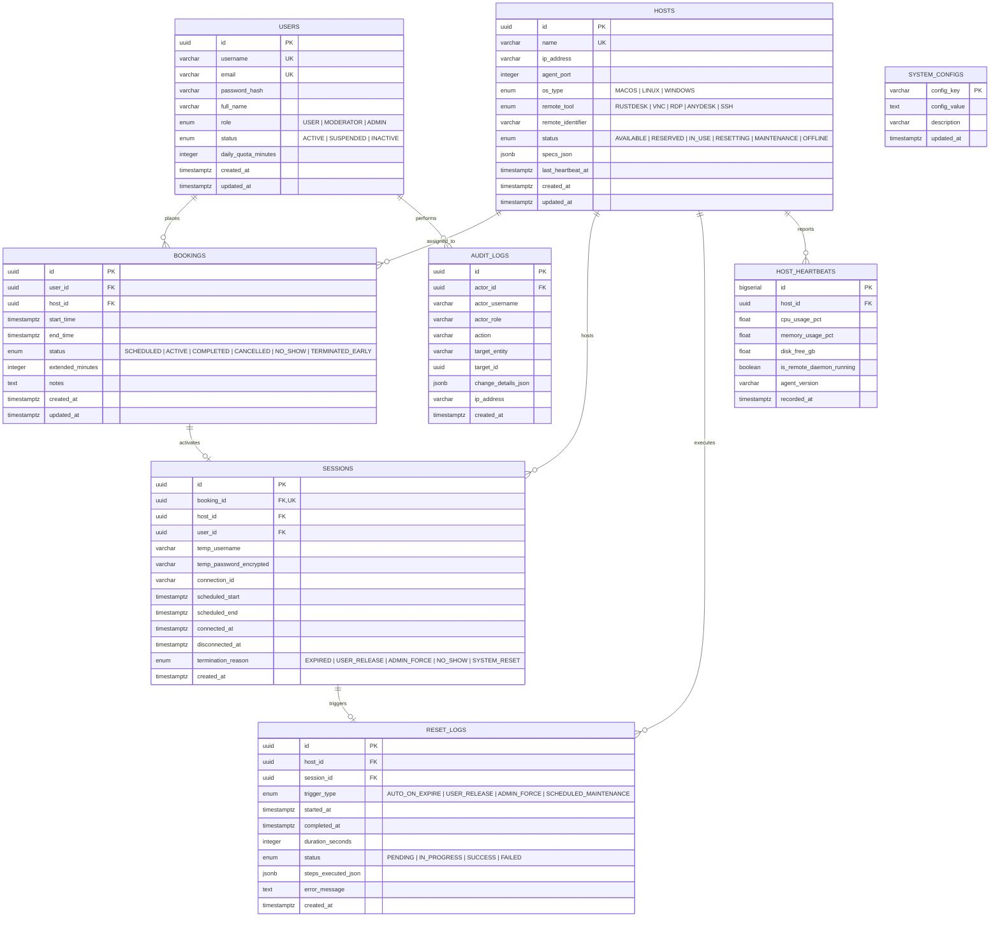

# เอกสารการออกแบบฐานข้อมูล (Database Design Specification)
## โครงการ: Mactile (MVP) — แพลตฟอร์มบริหารจัดการจองคิวและการเข้าถึงเครื่องรีโมท
**กลุ่มที่:** 4  
**เวอร์ชันเอกสาร:** 1.0  
**วันที่จัดทำ:** 16 สิงหาคม 2026  
**เอกสารอ้างอิง:** [docs/project_charter.md](file:///D:/LAB-DOC/docs/project_charter.md) | [docs/Requirement_specification.md](file:///D:/LAB-DOC/docs/Requirement_specification.md) | [docs/Acceptance_criteria.md](file:///D:/LAB-DOC/docs/Acceptance_criteria.md)

---

## 1. บทนำและสถาปัตยกรรมฐานข้อมูล (Introduction & Database Architecture)

### 1.1 วัตถุประสงค์
เอกสารนี้จัดทำขึ้นเพื่อกำหนดโครงสร้างฐานข้อมูลเชิงสัมพันธ์ (Relational Database Schema), พจนานุกรมข้อมูล (Data Dictionary), ดัชนี (Indexes), ความสัมพันธ์ระหว่างเอนทิตี (Entity Relationships) ตลอดจนสคริปต์ SQL DDL สำหรับระบบ **Mactile (MVP)**

### 1.2 การเลือกใช้เทคโนโลยี (Database Engine Selection)
- **ระบบฐานข้อมูลหลัก:** **PostgreSQL** (เวอร์ชัน 15+ หรือ SQLite สำหรับ Development/Testing)
- **เหตุผลการเลือกใช้:**
  - รองรับการทำ Transaction แบบ ACID อย่างเข้มงวด ป้องกันปัญหา Double Booking / Race Condition
  - รองรับชนิดข้อมูล `JSONB`, `UUID`, `TIMESTAMP WITH TIME ZONE` และ `ENUM`
  - มีฟังก์ชันคำนวณและตรวจสอบช่วงเวลา (Range Types & Exclusion Constraints เช่น `tsrange`) ซึ่งเหมาะกับระบบจองคิวตามเวลา

---

## 2. แผนภาพความสัมพันธ์ของข้อมูล (Entity-Relationship Diagram - ERD)



---

## 3. พจานุกรมข้อมูลอย่างละเอียด (Detailed Data Dictionary)

### 3.1 ตาราง: `users` (ข้อมูลผู้ใช้งาน)
เก็บบัญชีผู้ใช้งาน สิทธิ์ และโควตาการใช้งานเครื่อง

| คอลัมน์ (Column) | ชนิดข้อมูล (Data Type) | Nullable | Default | Constraints / หมายเหตุ |
| :--- | :--- | :---: | :--- | :--- |
| `id` | `UUID` | No | `gen_random_uuid()` | Primary Key |
| `username` | `VARCHAR(50)` | No | - | Unique, ดัชนีค้นหา |
| `email` | `VARCHAR(255)` | No | - | Unique, ใช้อีเมลสถาบัน/องค์กร |
| `password_hash` | `VARCHAR(255)` | No | - | Bcrypt / Argon2 hash |
| `full_name` | `VARCHAR(150)` | No | - | ชื่อ-นามสกุล |
| `role` | `user_role_enum` | No | `'USER'` | ค่า: `'USER'`, `'MODERATOR'`, `'ADMIN'` |
| `status` | `user_status_enum` | No | `'ACTIVE'` | ค่า: `'ACTIVE'`, `'SUSPENDED'`, `'INACTIVE'` |
| `daily_quota_minutes`| `INTEGER` | No | `120` | โควตาเวลาใช้งานต่อวัน (หน่วย: นาที) |
| `created_at` | `TIMESTAMPTZ` | No | `NOW()` | วันเวลาที่สร้าง |
| `updated_at` | `TIMESTAMPTZ` | No | `NOW()` | วันเวลาที่แก้ไขล่าสุด |

---

### 3.2 ตาราง: `hosts` (เครื่องคอมพิวเตอร์เป้าหมาย)
เก็บรายละเอียดเครื่องปลายทาง สถานะปัจจุบัน และชนิดโปรแกรมรีโมท

| คอลัมน์ (Column) | ชนิดข้อมูล (Data Type) | Nullable | Default | Constraints / หมายเหตุ |
| :--- | :--- | :---: | :--- | :--- |
| `id` | `UUID` | No | `gen_random_uuid()` | Primary Key |
| `name` | `VARCHAR(100)` | No | - | Unique (เช่น `Mac-Mini-M2-01`, `Ubuntu-Build-01`) |
| `ip_address` | `VARCHAR(45)` | No | - | IPv4 หรือ IPv6 ของเครื่องปลายทาง |
| `agent_port` | `INTEGER` | No | `8088` | พอร์ตของ Host Agent Daemon |
| `os_type` | `os_type_enum` | No | - | ค่า: `'MACOS'`, `'LINUX'`, `'WINDOWS'` |
| `remote_tool` | `remote_tool_enum` | No | - | ค่า: `'RUSTDESK'`, `'VNC'`, `'RDP'`, `'ANYDESK'`, `'SSH'` |
| `remote_identifier`| `VARCHAR(100)` | Yes | `NULL` | ID ของโปรแกรมรีโมท (เช่น RustDesk ID / VNC Display) |
| `status` | `host_status_enum` | No | `'AVAILABLE'`| ค่า: `'AVAILABLE'`, `'RESERVED'`, `'IN_USE'`, `'RESETTING'`, `'MAINTENANCE'`, `'OFFLINE'` |
| `specs_json` | `JSONB` | Yes | `'{}'` | ข้อมูลสเปก (CPU, RAM, Disk, OS Version) |
| `last_heartbeat_at`| `TIMESTAMPTZ` | Yes | `NULL` | สัญญาณชีพล่าสุดจาก Host Agent |
| `created_at` | `TIMESTAMPTZ` | No | `NOW()` | วันเวลาที่ลงทะเบียนเครื่อง |
| `updated_at` | `TIMESTAMPTZ` | No | `NOW()` | วันเวลาที่อัปเดตข้อมูล |

---

### 3.3 ตาราง: `bookings` (ข้อมูลการจองคิว)
เก็บข้อมูลการจองคิวสล็อตเวลาของผู้ใช้กับเครื่อง Host

| คอลัมน์ (Column) | ชนิดข้อมูล (Data Type) | Nullable | Default | Constraints / หมายเหตุ |
| :--- | :--- | :---: | :--- | :--- |
| `id` | `UUID` | No | `gen_random_uuid()` | Primary Key |
| `user_id` | `UUID` | No | - | FK -> `users(id)` ON DELETE RESTRICT |
| `host_id` | `UUID` | No | - | FK -> `hosts(id)` ON DELETE RESTRICT |
| `start_time` | `TIMESTAMPTZ` | No | - | เวลาเริ่มต้นสล็อตการจอง |
| `end_time` | `TIMESTAMPTZ` | No | - | เวลาสิ้นสุดสล็อตการจอง (`end_time > start_time`) |
| `status` | `booking_status_enum`| No | `'SCHEDULED'` | ค่า: `'SCHEDULED'`, `'ACTIVE'`, `'COMPLETED'`, `'CANCELLED'`, `'NO_SHOW'`, `'TERMINATED_EARLY'` |
| `extended_minutes`| `INTEGER` | No | `0` | จำนวนนาทีที่ขอต่อเวลาสะสม |
| `notes` | `TEXT` | Yes | `NULL` | จุดประสงค์การใช้งาน / หมายเหตุ |
| `created_at` | `TIMESTAMPTZ` | No | `NOW()` | วันเวลาที่กดยืนยันการจอง |
| `updated_at` | `TIMESTAMPTZ` | No | `NOW()` | วันเวลาที่ปรับปรุงสถานะ |

---

### 3.4 ตาราง: `sessions` (เซสชันการเชื่อมต่อรีโมทชั่วคราว)
เก็บข้อมูล Credential ชั่วคราว และประวัติการเชื่อมต่อของแต่ละรอบการจอง

| คอลัมน์ (Column) | ชนิดข้อมูล (Data Type) | Nullable | Default | Constraints / หมายเหตุ |
| :--- | :--- | :---: | :--- | :--- |
| `id` | `UUID` | No | `gen_random_uuid()` | Primary Key |
| `booking_id` | `UUID` | No | - | FK -> `bookings(id)` ON DELETE CASCADE, Unique |
| `host_id` | `UUID` | No | - | FK -> `hosts(id)` ON DELETE RESTRICT |
| `user_id` | `UUID` | No | - | FK -> `users(id)` ON DELETE RESTRICT |
| `temp_username` | `VARCHAR(50)` | No | - | ชื่อผู้ใช้ชั่วคราวบน Host |
| `temp_password_encrypted` | `TEXT` | No | - | รหัสผ่าน One-time ที่ถูกเข้ารหัสสมมาตร (AES-256) |
| `connection_id` | `VARCHAR(100)` | Yes | `NULL` | รหัสห้องหรือ Connection URL สำหรับรีโมท |
| `scheduled_start`| `TIMESTAMPTZ` | No | - | กำหนดเวลาเริ่มตามการจอง |
| `scheduled_end` | `TIMESTAMPTZ` | No | - | กำหนดเวลาสิ้นสุดตามการจอง |
| `connected_at` | `TIMESTAMPTZ` | Yes | `NULL` | เวลาที่ผู้ใช้เริ่มเชื่อมต่อจริง |
| `disconnected_at`| `TIMESTAMPTZ` | Yes | `NULL` | เวลาที่เซสชันถูกตัด/คืนเครื่อง |
| `termination_reason` | `termination_reason_enum` | Yes | `NULL` | ค่า: `'EXPIRED'`, `'USER_RELEASE'`, `'ADMIN_FORCE'`, `'NO_SHOW'`, `'SYSTEM_RESET'` |
| `created_at` | `TIMESTAMPTZ` | No | `NOW()` | วันเวลาที่สร้างเซสชัน |

---

### 3.5 ตาราง: `reset_logs` (บันทึกการรีเซ็ตสภาพแวดล้อม)
เก็บประวัติและผลลัพธ์การรันสคริปต์ทำความสะอาดเครื่องของ Host Agent

| คอลัมน์ (Column) | ชนิดข้อมูล (Data Type) | Nullable | Default | Constraints / หมายเหตุ |
| :--- | :--- | :---: | :--- | :--- |
| `id` | `UUID` | No | `gen_random_uuid()` | Primary Key |
| `host_id` | `UUID` | No | - | FK -> `hosts(id)` ON DELETE CASCADE |
| `session_id` | `UUID` | Yes | `NULL` | FK -> `sessions(id)` ON DELETE SET NULL |
| `trigger_type` | `reset_trigger_enum` | No | - | ค่า: `'AUTO_ON_EXPIRE'`, `'USER_RELEASE'`, `'ADMIN_FORCE'`, `'SCHEDULED_MAINTENANCE'` |
| `started_at` | `TIMESTAMPTZ` | No | `NOW()` | เวลาเริ่มต้นรันสคริปต์ |
| `completed_at` | `TIMESTAMPTZ` | Yes | `NULL` | เวลาที่สคริปต์เสร็จสิ้น |
| `duration_seconds`| `INTEGER` | Yes | `NULL` | ระยะเวลาที่ใช้รีเซ็ต (วินาที) |
| `status` | `reset_status_enum` | No | `'PENDING'` | ค่า: `'PENDING'`, `'IN_PROGRESS'`, `'SUCCESS'`, `'FAILED'` |
| `steps_executed_json` | `JSONB` | Yes | `'[]'` | รายละเอียดขั้นตอนที่รัน (Kill, Clean, Restore, HealthCheck) |
| `error_message` | `TEXT` | Yes | `NULL` | ข้อความ Error (หากรันไม่สำเร็จ) |
| `created_at` | `TIMESTAMPTZ` | No | `NOW()` | วันเวลาที่บันทึก |

---

### 3.6 ตาราง: `host_heartbeats` (สัญญาณชีพและสถานะฮาร์ดแวร์)
เก็บสถิติประสิทธิภาพเครื่องแบบ Time-series สำหรับการมอนิเตอร์บน Dashboard

| คอลัมน์ (Column) | ชนิดข้อมูล (Data Type) | Nullable | Default | Constraints / หมายเหตุ |
| :--- | :--- | :---: | :--- | :--- |
| `id` | `BIGSERIAL` | No | Auto-increment | Primary Key |
| `host_id` | `UUID` | No | - | FK -> `hosts(id)` ON DELETE CASCADE |
| `cpu_usage_pct` | `REAL` | Yes | `NULL` | อัตราการใช้ CPU (%) |
| `memory_usage_pct`| `REAL` | Yes | `NULL` | อัตราการใช้ RAM (%) |
| `disk_free_gb` | `REAL` | Yes | `NULL` | พื้นที่ว่างในดิสก์ (GB) |
| `is_remote_daemon_running` | `BOOLEAN`| No | `TRUE` | โปรแกรมรีโมทเปิดทำงานปกติหรือไม่ |
| `agent_version` | `VARCHAR(20)` | Yes | `NULL` | เวอร์ชันของ Agent Daemon |
| `recorded_at` | `TIMESTAMPTZ` | No | `NOW()` | เวลาที่บันทึกข้อมูล |

---

### 3.7 ตาราง: `audit_logs` (บันทึกประวัติการกระทำในระบบ)
เก็บบันทึกประวัติกิจกรรมของ Admin และระบบ เพื่อความโปร่งใสและตรวจสอบย้อนหลัง

| คอลัมน์ (Column) | ชนิดข้อมูล (Data Type) | Nullable | Default | Constraints / หมายเหตุ |
| :--- | :--- | :---: | :--- | :--- |
| `id` | `UUID` | No | `gen_random_uuid()` | Primary Key |
| `actor_id` | `UUID` | Yes | `NULL` | FK -> `users(id)` (NULL หากเกิดจาก System Cron) |
| `actor_username`| `VARCHAR(50)` | Yes | `NULL` | บันทึก Username ณ ขณะนั้น |
| `actor_role` | `VARCHAR(20)` | Yes | `NULL` | บันทึก Role ณ ขณะนั้น |
| `action` | `VARCHAR(100)` | No | - | เช่น `'FORCE_DISCONNECT'`, `'FORCE_RESET'`, `'EXTEND_BOOKING'` |
| `target_entity` | `VARCHAR(50)` | No | - | เช่น `'HOST'`, `'BOOKING'`, `'USER'`, `'CONFIG'` |
| `target_id` | `UUID` | Yes | `NULL` | รหัส Entity เป้าหมาย |
| `change_details_json`| `JSONB` | Yes | `'{}'` | ค่าก่อนหน้าและค่าหลังการแก้ไข |
| `ip_address` | `VARCHAR(45)` | Yes | `NULL` | IP ของผู้เรียกคำสั่ง |
| `created_at` | `TIMESTAMPTZ` | No | `NOW()` | เวลาที่เกิดการกระทำ |

---

### 3.8 ตาราง: `system_configs` (การตั้งค่านโยบายส่วนกลาง)
เก็บค่าพารามิเตอร์นโยบายของระบบในรูปแบบ Key-Value

| คอลัมน์ (Column) | ชนิดข้อมูล (Data Type) | Nullable | Constraints / หมายเหตุ |
| :--- | :--- | :---: | :--- |
| `config_key` | `VARCHAR(100)` | No | Primary Key (เช่น `MAX_SLOT_DURATION_MIN`) |
| `config_value` | `TEXT` | No | ค่าการตั้งค่า (เช่น `120`, `30`, `true`) |
| `description` | `VARCHAR(255)` | Yes | คำอธิบายการตั้งค่า |
| `updated_at` | `TIMESTAMPTZ` | No | วันเวลาที่แก้ไขล่าสุด |

---

## 4. กลยุทธ์การสร้างดัชนี (Indexing Strategy)

เพื่อเพิ่มความเร็วในการสืบค้นข้อมูลในสถานการณ์ที่ระบบมีภาระงานสูง (High Query Load) และป้องกันการจองเวลาทับซ้อน:

```sql
-- 1. ป้องกันการจองช่วงเวลาทับซ้อนบน Host เครื่องเดียวกัน (Overlapping Booking Prevention)
CREATE EXTENSION IF NOT EXISTS btree_gist;

CREATE INDEX idx_bookings_host_timerange ON bookings 
USING GIST (host_id, tstzrange(start_time, end_time)) 
WHERE status IN ('SCHEDULED', 'ACTIVE');

-- 2. ค้นหาการจองที่กำลังจะเริ่มหรือหมดเวลา (สำหรับ Background Scheduler / Cron)
CREATE INDEX idx_bookings_active_window ON bookings (start_time, end_time, status);

-- 3. ค้นหาคิวตามผู้ใช้ (My Bookings)
CREATE INDEX idx_bookings_user_status ON bookings (user_id, status);

-- 4. ค้นหาสถานะเครื่อง Host ที่พร้อมใช้งาน
CREATE INDEX idx_hosts_status_os ON hosts (status, os_type);

-- 5. สืบค้นสัญญาณ Heartbeat ล่าสุดของ Host
CREATE INDEX idx_heartbeats_host_recorded ON host_heartbeats (host_id, recorded_at DESC);

-- 6. สืบค้นประวัติ Audit Log ตาม Entity และเวลา
CREATE INDEX idx_audit_logs_target_created ON audit_logs (target_entity, target_id, created_at DESC);
```

---

## 5. สคริปต์ SQL DDL สำหรับสร้างฐานข้อมูล (PostgreSQL DDL Scripts)

```sql
-- สร้าง Extension ที่จำเป็น
CREATE EXTENSION IF NOT EXISTS "uuid-ossp";
CREATE EXTENSION IF NOT EXISTS "btree_gist";

-- สร้าง Enum Types
CREATE TYPE user_role_enum AS ENUM ('USER', 'MODERATOR', 'ADMIN');
CREATE TYPE user_status_enum AS ENUM ('ACTIVE', 'SUSPENDED', 'INACTIVE');
CREATE TYPE os_type_enum AS ENUM ('MACOS', 'LINUX', 'WINDOWS');
CREATE TYPE remote_tool_enum AS ENUM ('RUSTDESK', 'VNC', 'RDP', 'ANYDESK', 'SSH');
CREATE TYPE host_status_enum AS ENUM ('AVAILABLE', 'RESERVED', 'IN_USE', 'RESETTING', 'MAINTENANCE', 'OFFLINE');
CREATE TYPE booking_status_enum AS ENUM ('SCHEDULED', 'ACTIVE', 'COMPLETED', 'CANCELLED', 'NO_SHOW', 'TERMINATED_EARLY');
CREATE TYPE termination_reason_enum AS ENUM ('EXPIRED', 'USER_RELEASE', 'ADMIN_FORCE', 'NO_SHOW', 'SYSTEM_RESET');
CREATE TYPE reset_trigger_enum AS ENUM ('AUTO_ON_EXPIRE', 'USER_RELEASE', 'ADMIN_FORCE', 'SCHEDULED_MAINTENANCE');
CREATE TYPE reset_status_enum AS ENUM ('PENDING', 'IN_PROGRESS', 'SUCCESS', 'FAILED');

-- 1. ตาราง Users
CREATE TABLE users (
    id UUID PRIMARY KEY DEFAULT gen_random_uuid(),
    username VARCHAR(50) UNIQUE NOT NULL,
    email VARCHAR(255) UNIQUE NOT NULL,
    password_hash VARCHAR(255) NOT NULL,
    full_name VARCHAR(150) NOT NULL,
    role user_role_enum NOT NULL DEFAULT 'USER',
    status user_status_enum NOT NULL DEFAULT 'ACTIVE',
    daily_quota_minutes INTEGER NOT NULL DEFAULT 120,
    created_at TIMESTAMPTZ NOT NULL DEFAULT NOW(),
    updated_at TIMESTAMPTZ NOT NULL DEFAULT NOW()
);

-- 2. ตาราง Hosts
CREATE TABLE hosts (
    id UUID PRIMARY KEY DEFAULT gen_random_uuid(),
    name VARCHAR(100) UNIQUE NOT NULL,
    ip_address VARCHAR(45) NOT NULL,
    agent_port INTEGER NOT NULL DEFAULT 8088,
    os_type os_type_enum NOT NULL,
    remote_tool remote_tool_enum NOT NULL,
    remote_identifier VARCHAR(100),
    status host_status_enum NOT NULL DEFAULT 'AVAILABLE',
    specs_json JSONB DEFAULT '{}',
    last_heartbeat_at TIMESTAMPTZ,
    created_at TIMESTAMPTZ NOT NULL DEFAULT NOW(),
    updated_at TIMESTAMPTZ NOT NULL DEFAULT NOW()
);

-- 3. ตาราง Bookings
CREATE TABLE bookings (
    id UUID PRIMARY KEY DEFAULT gen_random_uuid(),
    user_id UUID NOT NULL REFERENCES users(id) ON DELETE RESTRICT,
    host_id UUID NOT NULL REFERENCES hosts(id) ON DELETE RESTRICT,
    start_time TIMESTAMPTZ NOT NULL,
    end_time TIMESTAMPTZ NOT NULL,
    status booking_status_enum NOT NULL DEFAULT 'SCHEDULED',
    extended_minutes INTEGER NOT NULL DEFAULT 0,
    notes TEXT,
    created_at TIMESTAMPTZ NOT NULL DEFAULT NOW(),
    updated_at TIMESTAMPTZ NOT NULL DEFAULT NOW(),
    CONSTRAINT chk_booking_time CHECK (end_time > start_time)
);

-- 4. ตาราง Sessions
CREATE TABLE sessions (
    id UUID PRIMARY KEY DEFAULT gen_random_uuid(),
    booking_id UUID UNIQUE NOT NULL REFERENCES bookings(id) ON DELETE CASCADE,
    host_id UUID NOT NULL REFERENCES hosts(id) ON DELETE RESTRICT,
    user_id UUID NOT NULL REFERENCES users(id) ON DELETE RESTRICT,
    temp_username VARCHAR(50) NOT NULL,
    temp_password_encrypted TEXT NOT NULL,
    connection_id VARCHAR(100),
    scheduled_start TIMESTAMPTZ NOT NULL,
    scheduled_end TIMESTAMPTZ NOT NULL,
    connected_at TIMESTAMPTZ,
    disconnected_at TIMESTAMPTZ,
    termination_reason termination_reason_enum,
    created_at TIMESTAMPTZ NOT NULL DEFAULT NOW()
);

-- 5. ตาราง Reset Logs
CREATE TABLE reset_logs (
    id UUID PRIMARY KEY DEFAULT gen_random_uuid(),
    host_id UUID NOT NULL REFERENCES hosts(id) ON DELETE CASCADE,
    session_id UUID REFERENCES sessions(id) ON DELETE SET NULL,
    trigger_type reset_trigger_enum NOT NULL,
    started_at TIMESTAMPTZ NOT NULL DEFAULT NOW(),
    completed_at TIMESTAMPTZ,
    duration_seconds INTEGER,
    status reset_status_enum NOT NULL DEFAULT 'PENDING',
    steps_executed_json JSONB DEFAULT '[]',
    error_message TEXT,
    created_at TIMESTAMPTZ NOT NULL DEFAULT NOW()
);

-- 6. ตาราง Host Heartbeats
CREATE TABLE host_heartbeats (
    id BIGSERIAL PRIMARY KEY,
    host_id UUID NOT NULL REFERENCES hosts(id) ON DELETE CASCADE,
    cpu_usage_pct REAL,
    memory_usage_pct REAL,
    disk_free_gb REAL,
    is_remote_daemon_running BOOLEAN NOT NULL DEFAULT TRUE,
    agent_version VARCHAR(20),
    recorded_at TIMESTAMPTZ NOT NULL DEFAULT NOW()
);

-- 7. ตาราง Audit Logs
CREATE TABLE audit_logs (
    id UUID PRIMARY KEY DEFAULT gen_random_uuid(),
    actor_id UUID REFERENCES users(id) ON DELETE SET NULL,
    actor_username VARCHAR(50),
    actor_role VARCHAR(20),
    action VARCHAR(100) NOT NULL,
    target_entity VARCHAR(50) NOT NULL,
    target_id UUID,
    change_details_json JSONB DEFAULT '{}',
    ip_address VARCHAR(45),
    created_at TIMESTAMPTZ NOT NULL DEFAULT NOW()
);

-- 8. ตาราง System Configs
CREATE TABLE system_configs (
    config_key VARCHAR(100) PRIMARY KEY,
    config_value TEXT NOT NULL,
    description VARCHAR(255),
    updated_at TIMESTAMPTZ NOT NULL DEFAULT NOW()
);

-- ค่าเริ่มต้นสำหรับการตั้งค่าระบบ
INSERT INTO system_configs (config_key, config_value, description) VALUES
('MAX_SLOT_DURATION_MINUTES', '120', 'ระยะเวลาสูงสุดที่อนุญาตให้จองต่อครั้ง (นาที)'),
('DEFAULT_DAILY_QUOTA_MINUTES', '180', 'โควตาเวลาใช้งานพื้นฐานต่อวันของผู้ใช้ทั่วไป (นาที)'),
('NO_SHOW_TIMEOUT_MINUTES', '10', 'ระยะเวลารอผู้ใช้เข้าใช้งานก่อนตัดสิทธิ์ No-show (นาที)'),
('HOST_HEARTBEAT_TIMEOUT_SECONDS', '30', 'ระยะเวลาขาดสัญญาณ Heartbeat ก่อนเปลี่ยนสถานะเป็น Offline (วินาที)'),
('RESET_TIMEOUT_SECONDS', '90', 'ระยะเวลาสูงสุดที่อนุญาตให้รันสคริปต์รีเซ็ตก่อนตัดเข้า Maintenance (วินาที)');
```

---

## 6. นโยบายการบริหารจัดการและการเก็บรักษาข้อมูล (Data Retention & Maintenance)

1. **Host Heartbeats:** เก็บข้อมูลย้อนหลัง 7 วันเพื่อใช้วิเคราะห์กราฟประสิทธิภาพ จากนั้นระบบ Cron Job จะลบข้อมูลเก่าทิ้ง (Data Purging) หรือทำ Aggregation เป็นรายชั่วโมง
2. **Audit Logs & Reset Logs:** เก็บข้อมูลย้อนหลังอย่างน้อย 90 วัน เพื่อความปลอดภัยและการตรวจสอบย้อนหลัง
3. **Session Credentials:** `temp_password_encrypted` จะถูกเคลียร์ทิ้ง (`NULL` หรือ Overwrite) ทันทีที่เซสชันสิ้นสุดลงและสคริปต์รีเซ็ตทำงานเสร็จสิ้น เพื่อความปลอดภัยระดับสูงสุด
