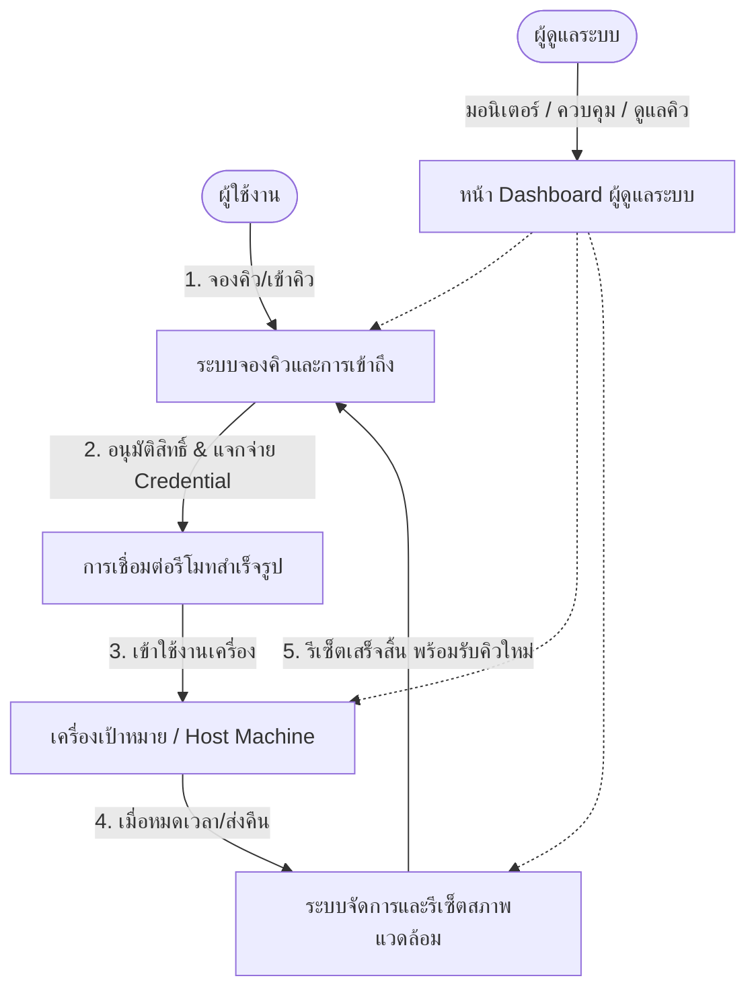

# เอกสารข้อเสนอโครงการ (Project Charter)
## โครงการ: Mactile (MVP) — แพลตฟอร์มบริหารจัดการจองคิวและการเข้าถึงเครื่องรีโมท
**กลุ่มที่:** 4  
**เวอร์ชันเอกสาร:** 1.0  
**วันที่จัดทำ:** 16 สิงหาคม 2026  
**สถานะ:** ฉบับร่างสำหรับพัฒนาขั้นต้น (MVP Phase)

---

## 1. ข้อมูลภาพรวมโครงการ (Project Overview)

### 1.1 ที่มาและความสำคัญ (Background & Problem Statement)
ในสภาพแวดล้อมการทำงาน การทดสอบ หรือการเรียนการสอนที่มีทรัพยากรเครื่องจำกัด (เช่น เครื่องสำหรับ Build/Test, อุปกรณ์ระบบปฏิบัติการเฉพาะ หรือเครื่อง Workstation ในห้องปฏิบัติการ) มักประสบปัญหา:
- **การแย่งใช้งานและการประสานงานที่ซ้ำซ้อน:** ไม่มีระบบจัดคิวที่เป็นธรรมและชัดเจน
- **ความไม่ปลอดภัยและความไม่เสถียรของสภาพแวดล้อม:** ผู้ใช้งานคนก่อนหน้าทิ้งไฟล์ แคช หรือการตั้งค่าไว้ ส่งผลกระทบต่อผู้ใช้งานคนถัดไป
- **ภาระงานของผู้ดูแลระบบ:** แอดมินต้องคอยแจกจ่ายรหัสผ่าน ตรวจสอบเครื่อง และรีเซ็ตระบบด้วยตนเองแบบ Manual

### 1.2 วัตถุประสงค์โครงการ (Project Objectives)
- พัฒนาระบบรวมศูนย์เพื่อจัดการจองคิวและการเข้าถึงเครื่องอย่างมีประสิทธิภาพและโปร่งใส
- มีระบบทำความสะอาดและรีเซ็ตสภาพแวดล้อมเบื้องต้นแบบอัตโนมัติ เพื่อให้เครื่องพร้อมใช้งานเสมอสำหรับคิวถัดไป
- ใช้ประโยชน์จากโปรแกรมรีโมทสำเร็จรูปที่มีอยู่แล้ว (Off-the-shelf Remote Tools) เพื่อความสะดวกรวดเร็วและเสถียรภาพ
- จัดเตรียมหน้าต่างควบคุม (Admin Dashboard) สำหรับผู้ดูแลระบบในการเฝ้าระวัง จัดการคิว และตรวจสอบประวัติการใช้งาน

---

## 2. ขอบเขตของโครงการ (Project Scope - MVP)

ขอบเขตการดำเนินงานสำหรับเวอร์ชัน MVP (Minimum Viable Product) แบ่งออกเป็น 4 ฟังก์ชันหลัก ดังนี้:

### 2.1 ระบบจองคิวและการเข้าถึง (Queue Booking & Access Management)
- **ระบบเลือกช่วงเวลาและจัดคิว (Queue/Slot Scheduling):** ผู้ใช้สามารถดูสถานะเครื่องที่ว่าง และกดจองคิวหรือเลือกช่วงเวลาใช้งานที่ต้องการ
- **การจัดการสิทธิ์ตามช่วงเวลา (Time-based Access Control):** อนุญาตให้เข้าถึงเครื่องได้เฉพาะผู้ที่ถึงคิวและอยู่ในช่วงเวลาที่ได้รับอนุมัติ
- **การแจ้งเตือนสถานะคิว (Notifications):** แจ้งเตือนเมื่อใกล้ถึงคิว แจ้งเตือนเมื่อเริ่มใช้งาน และแจ้งเตือนก่อนหมดเวลา (เช่น ล่วงหน้า 5 นาทีก่อนหมดรอบ)
- **การจัดการคืนเครื่องและต่อเวลา (Release & Extend Session):** ผู้ใช้สามารถกดคืนเครื่องก่อนกำหนด หรือส่งคำขอต่อเวลาได้หากไม่มีคิวรอต่อท้าย

### 2.2 ระบบจัดการและรีเซ็ตสภาพแวดล้อมเบื้องต้น (Environment Management & Basic Reset)
- **สคริปต์ทำความสะอาดอัตโนมัติ (Automated Cleanup Script):** ทำงานอัตโนมัติเมื่อสิ้นสุดช่วงเวลาการใช้งาน
  - ลบไฟล์ชั่วคราวในโฟลเดอร์ทำงาน / แคช / ดาวน์โหลดของผู้ใช้งาน
  - ปิดโปรแกรมและ Kill Process ที่ผู้ใช้เปิดค้างไว้
  - เคลียร์ประวัติการเข้าสู่ระบบเบื้องต้น (Session/Credential cleanup)
- **การคืนค่าสภาพแวดล้อมมาตรฐาน (State Reset / Baseline Restore):** รีเซ็ตการตั้งค่าพื้นฐานกลับสู่ Baseline หรือ Snapshot ล่าสุด
- **ระบบตรวจสอบความพร้อมของเครื่อง (Host Health Check):** ตรวจสอบสถานะการเชื่อมต่อ ฮาร์ดแวร์พื้นฐาน และสถานะความพร้อม (Available, Busy, Resetting, Offline) ก่อนส่งมอบให้คิวถัดไป

### 2.3 การเชื่อมต่อรีโมทด้วยโปรแกรมสำเร็จรูป (Remote Connection via Existing Tools)
- **การผนวกรวมโปรแกรมรีโมทสำเร็จรูป (Off-the-shelf Integration):** รองรับและเชื่อมโยงกับโปรแกรมรีโมทยอดนิยม เช่น:
  - RustDesk / AnyDesk / TeamViewer
  - VNC (macOS Screen Sharing / RealVNC / TightVNC)
  - Microsoft Remote Desktop (RDP) / SSH
- **การส่งต่อข้อมูลการเชื่อมต่อที่ปลอดภัย (Secure Credential Delivery):**
  - ส่งมอบ Connection ID, IP/Port, หรือ One-time Access Token / Temporary Password ให้แก่ผู้ใช้ที่มีสิทธิ์ตามคิว
  - เปลี่ยนรหัสผ่านหรือตัดสิทธิ์การเข้าถึงทันทีเมื่อหมดเวลาการใช้งาน

### 2.4 หน้า Dashboard ผู้ดูแลระบบ (Admin Dashboard)
- **ระบบเฝ้าติดตามสถานะแบบเรียลไทม์ (Real-time Machine Monitoring):**
  - แสดงรายการเครื่อง สถานะปัจจุบัน (Online, In-Use, Resetting, Maintenance)
  - แสดงชื่อผู้ใช้งานปัจจุบัน และเวลาคงเหลือของเซสชัน
- **ระบบจัดการคิวและการจอง (Queue & Booking Management):**
  - ดูรายการคิวทั้งหมด จัดการคิวล่วงหน้า ยกเลิก หรือแทรกคิวกรณีจำเป็น
  - บังคับตัดเซสชัน (Force Disconnect) และสั่งรีเซ็ตเครื่องทันที (Force Reset)
- **ระบบจัดการผู้ใช้และนโยบาย (User & Policy Management):**
  - กำหนดโควตาการใช้งาน (Max duration per session, Max bookings per day)
  - จัดการรายชื่อผู้ใช้งานและบทบาท (User / Moderator / Admin)
- **บันทึกประวัติและการตรวจสอบ (Audit Logs & Reports):**
  - บันทึกประวัติการจอง การเข้าใช้งาน และประวัติการรันสคริปต์รีเซ็ต
  - สรุปสถิติอัตราการใช้งานเครื่อง (Utilization Rate)

---

## 3. สิ่งที่อยู่นอกเหนือขอบเขตในระยะ MVP (Out of Scope for MVP)
- การพัฒนา Protocol สำหรับรีโมทหน้าจอขึ้นมาเองใหม่ทั้งหมด
- ระบบ Virtualization เชิงลึกแบบ Multi-tenant Hypervisor ระดับ Enterprise
- การคิดค่าบริการหรือระบบชำระเงิน (Billing / Payment Gateway)
- การบันทึกวิดีโอหน้าจอขณะใช้งานอย่างต่อเนื่อง (Full Session Video Recording)

---

## 4. ผู้มีส่วนได้ส่วนเสียและกลุ่มเป้าหมาย (Stakeholders & Target Audience)

| กลุ่มผู้มีส่วนได้ส่วนเสีย | บทบาทและความรับผิดชอบ | ความต้องการหลัก |
| :--- | :--- | :--- |
| **ผู้ใช้งานทั่วไป (End Users / Developers / Students)** | ผู้จองคิวและเข้าใช้งานเครื่องรีโมทเพื่อทำงาน/ทดสอบ | จองคิวง่าย ทราบสถานะคิวชัดเจน เข้าใช้งานได้สะดวก และเครื่องสะอาดพร้อมใช้ |
| **ผู้ดูแลระบบ (System / Lab Administrators)** | ควบคุม ดูแลสภาพแวดล้อม และบำรุงรักษาเครื่อง | แดชบอร์ดตรวจสอบง่าย มีระบบรีเซ็ตอัตโนมัติ ไม่ต้องคอยแก้ปัญหาเครื่องค้าง |
| **ทีมพัฒนาโครงการ (Group 4 Development Team)** | ออกแบบ สถาปัตย์ พัฒนาระบบ และทดสอบระบบ | ขอบเขตงานชัดเจน สถาปัตยกรรมไม่ซับซ้อนเกินไป ส่งมอบได้ทันตามกำหนด |

---

## 5. แผนการดำเนินงานและเป้าหมายสำคัญ (Milestones & Roadmap)

| เฟส (Phase) | รายละเอียดกิจกรรมหลัก | ผลลัพธ์ที่คาดหวัง (Deliverables) |
| :---: | :--- | :--- |
| **Phase 1** | สำรวจความต้องการ, ออกแบบ System Architecture, กำหนด Data Schema | เอกสาร Requirement, Architecture Diagram, Database Schema |
| **Phase 2** | พัฒนาระบบจองคิว (Queue Engine) และการบริหารจัดการสิทธิ์ | ระบบ Authentication, Queueing & Booking API |
| **Phase 3** | พัฒนาสคริปต์รีเซ็ตสภาพแวดล้อม & การเชื่อมโยง Remote Tool | Cleanup Scripts, Host Agent/Service, Credential Dispatcher |
| **Phase 4** | พัฒนาหน้า Dashboard ผู้ดูแลระบบ และ UI สำหรับผู้ใช้งาน | หน้า Web Dashboard (User & Admin UI) |
| **Phase 5** | ทดสอบระบบแบบ End-to-End (Integration Testing) และนำร่องทดสอบ | เอกสารทดสอบ (Test Report), ระบบ MVP พร้อมใช้งาน |

---

## 6. การประเมินความเสี่ยงและมาตรการรับมือ (Risks & Mitigation)

| ความเสี่ยง (Risk) | ผลกระทบ | โอกาสเกิด | มาตรการรับมือ / ป้องกัน (Mitigation Strategy) |
| :--- | :---: | :---: | :--- |
| **ผู้ใช้ไม่ยอมคืนเครื่อง / ปล่อยเซสชันค้าง** | ปานกลาง | สูง | ใช้ระบบ Time-boxed Session ปิดกั้นการเชื่อมต่ออัตโนมัติเมื่อครบกำหนด |
| **สคริปต์รีเซ็ตทำงานไม่สมบูรณ์ หรือเครื่องค้าง** | สูง | ปานกลาง | มีระบบ Health Check หลังรีเซ็ต หากพบข้อผิดพลาดให้แจ้งเตือน Admin และมาร์กสถานะเป็น Maintenance |
| **ความปลอดภัยของรหัสผ่านการเชื่อมต่อ** | สูง | ต่ำ | ใช้ระบบ Temporary Password หรือ One-Time Token ที่เปลี่ยนใหม่ทุกรอบการใช้งาน |
| **ความหน่วงหรือปัญหาเครือข่ายของโปรแกรมรีโมท** | ปานกลาง | ปานกลาง | เลือกใช้โปรแกรมรีโมทสำเร็จรูปที่มีประสิทธิภาพสูงและเสถียรในเครือข่ายวงแลน/อินเทอร์เน็ต |

---

## 7. เกณฑ์การยอมรับความสำเร็จของ MVP (Acceptance Criteria)
1. ผู้ใช้งานสามารถล็อกอินเข้าสู่ระบบ ดูตารางคิว และทำการจองคิวสำเร็จ
2. เมื่อถึงคิว ระบบส่งข้อมูลการเข้าใช้งาน (Credentials / Connection Info) ให้ผู้ใช้ที่ได้รับสิทธิ์ได้ถูกต้อง
3. ผู้ใช้สามารถเชื่อมต่อรีโมทไปยังเครื่องปลายทางผ่านโปรแกรมสำเร็จรูปที่กำหนดได้
4. เมื่อหมดเวลา ระบบตัดการเชื่อมต่อและรันสคริปต์รีเซ็ตสภาพแวดล้อมของเครื่องเป้าหมายสำเร็จโดยอัตโนมัติ
5. แอดมินสามารถดูสถานะเครื่องทั้งหมด ดูรายการคิว และสามารถสั่ง Force Disconnect / Force Reset ผ่านหน้า Dashboard ได้อย่างถูกต้อง
